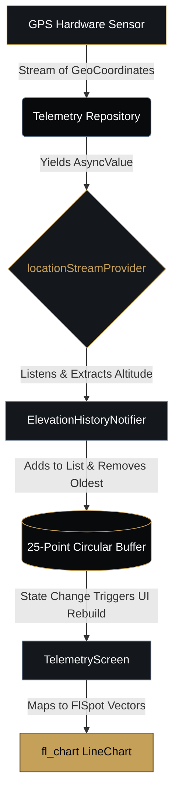

# TrailGauge 4x4 🧭

TrailGauge 4x4 is a tactical, high-performance Flutter application designed for off-road enthusiasts and overlanding professionals. It provides real-time telemetry, inertial monitoring, and environmental awareness to ensure safety and precision during off-grid driving.

## ✨ Features

### 📐 Active Clinometer (Pitch & Roll)
- **Real-Time Attitude Monitoring:** Precise measurement of your vehicle's pitch and roll angles.
- **Artificial Horizon:** Visual representation of the vehicle's inclination with dynamic wireframe styling.
- **Dynamic Safety States:** Visual alerts (Safe, Warning, Critical Danger) that adapt based on the current inclination and user-defined thresholds.

### 🛰️ Advanced Telemetry & GPS
- **Speed & Altitude Tracking:** Real-time speed and altitude readouts (with fallback between GPS and topographic APIs).
- **Rescue Transmission (DMS):** Critical location data formatted in Degrees, Minutes, Seconds (DMS) for quick relay to emergency rescue protocols.
- **Topographic Elevation Profile:** A dynamic, smoothly scrolling `fl_chart` that visualizes the terrain's elevation profile in real-time using a 25-point rolling circular buffer.

### ⚙️ Calibration & Settings
- **Inertial Module Calibration:** Reset the clinometer to a strict 0° artificial horizon when on level ground.
- **Custom Safety Limits:** Adjustable Pitch and Roll warning limits via intuitive sliders.
- **Suspension Geometry Algorithms:** Select between 'OEM Stock' and 'Modified (Elevated)' modes to automatically adjust the center of gravity calculations for safer limit estimation on modified rigs.

## 🎨 Visual Identity & UI
TrailGauge utilizes a custom **"Titanium & Sahara Gold"** high-end dark mode aesthetic optimized for tactical and high-contrast interfaces:
- **Neutral Scaffold:** Titanium Black (`#090A0C`)
- **Secondary Surfaces:** Deep Charcoal (`#14171C`)
- **Primary Accents:** Sahara Gold (`#C5A059`)
- **Tertiary UI:** Blue-Grey (`#64748B`)

Modern card interfaces (12px radius) and sophisticated typographies create a premium off-road dashboard feel.

## 🛠️ Architecture & Tech Stack

- **Framework:** [Flutter](https://flutter.dev/)
- **State Management:** [Riverpod](https://riverpod.dev/) (`flutter_riverpod`) utilizing clean state boundaries.
- **Data Visualization:** `fl_chart` for dynamic sensor streams.
- **Architecture:** Clean Architecture separation (Presentation, Domain, and Data layers). 

### 🧠 Data Flow Architecture
The following diagram illustrates how real-time GPS telemetry is processed through Riverpod to create the dynamic elevation profile:



## 🚀 Getting Started

### Prerequisites
- Flutter SDK
- Dart SDK
- Android Studio / Xcode for deployment

### Installation

1. Clone the repository:
   ```bash
   git clone https://github.com/AlvinSanchezO/TrailGauge4x4.git
   ```
2. Navigate to the project directory:
   ```bash
   cd trail_gauge_4x4
   ```
3. Install dependencies:
   ```bash
   flutter pub get
   ```
4. Run the app:
   ```bash
   flutter run
   ```

## 🤝 Contributing

Contributions, issues, and feature requests are welcome! Feel free to check the [issues page](https://github.com/AlvinSanchezO/TrailGauge4x4/issues) if you want to contribute.

## 📝 License

This project is licensed under the MIT License.
